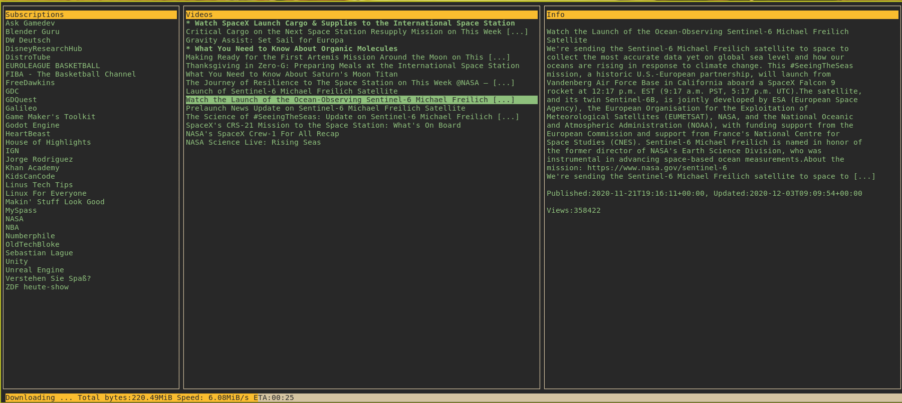

# YET - _Youtube export TUI_

yet is a console (kind of rss) application to download youtube videos. It uses _subscriptions.json_ file which comes with your youtube export data. It provides a minimalistic and nice curses interface. It uses [youtube-dl](https://github.com/ytdl-org/youtube-dl#output-template) to download videos.

## How to use

- First export your youtube data from https://takeout.google.com/, it should come with a subscriptions.json file.
- Move the subscriptions.json into $HOME/.config/yet folder
- Checkout this project.
- Install pip requirements. You can use a virtual environment.
- Run .../yet/main.py

The downloaded video files are saved under $HOME/Videos directory. Project is currently under development and missing a configuration file for customizations.
