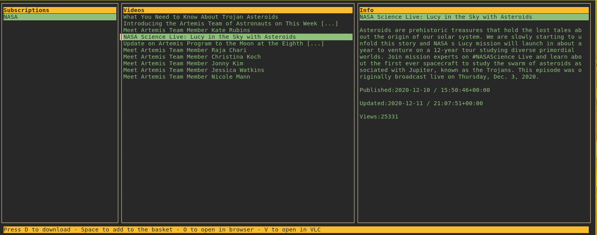

# YET - _Youtube export TUI_

yet is a console (kind of rss) application to download youtube videos. It uses _subscriptions.json_ file which comes with your youtube export data. It provides a minimalistic and nice curses interface. It uses [youtube-dl](https://github.com/ytdl-org/youtube-dl#output-template) to download videos.

## Installation

- First export your youtube data from https://takeout.google.com/, it should come with a subscriptions.json file.
- Move the subscriptions.json into $HOME/.config/yet folder

### Using Pip

- TODO

### From source

- Checkout this project.
- Install pip requirements. You can use a virtual environment.
- Run .../yet/main.py

The downloaded video files are saved under $HOME/Videos directory.

## Usage

Run 'yet' from your terminal emulator.

Use arrow keys or 'h,j,k,l' to navigate around.
_D_ to download, _V_ to open in VLC media player(if installed) and _O_ to open in browser. You can change the keybindings from the config file.

### Configuration

Copy the yet/config/yet.conf into ~/.cache/yet folder. The config file is self explanatory.
